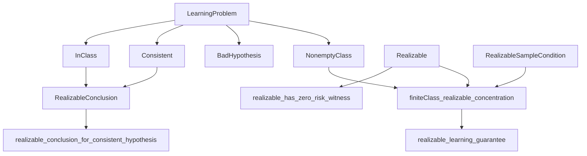
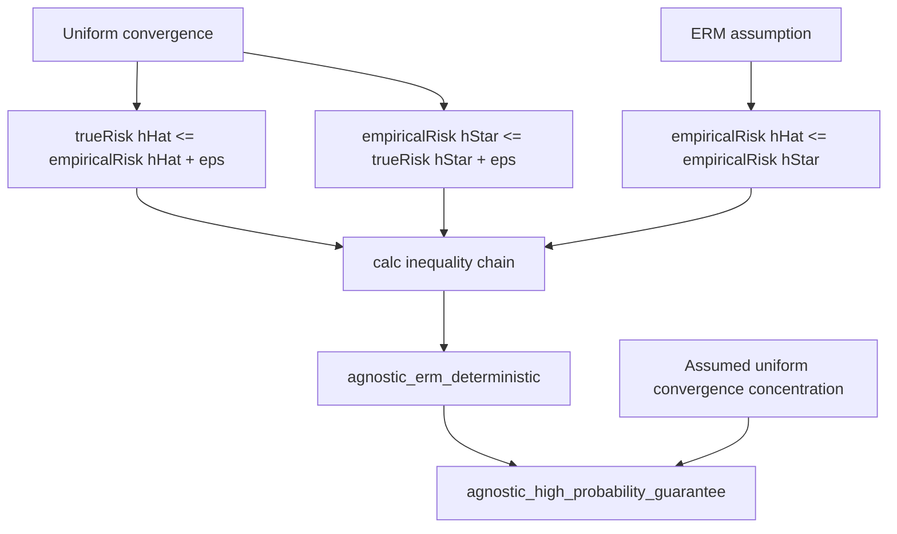
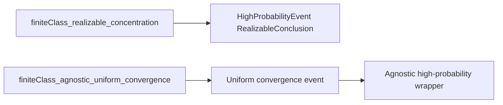

# Proof Dependency Graph

## Realizable Setting

```mermaid
flowchart TD
  A["LearningProblem"] --> B["InClass"]
  A --> C["Consistent"]
  A --> D["BadHypothesis"]
  A --> E["NonemptyClass"]
  F["Realizable"] --> G["realizable_has_zero_risk_witness"]
  E --> H["finiteClass_realizable_concentration"]
  I["RealizableSampleCondition"] --> H
  F --> H
  B --> J["RealizableConclusion"]
  C --> J
  H --> K["realizable_learning_guarantee"]
  J --> L["realizable_conclusion_for_consistent_hypothesis"]
```

## Agnostic Setting

```mermaid
flowchart TD
  A["Uniform convergence"] --> B["trueRisk hHat <= empiricalRisk hHat + eps"]
  C["ERM assumption"] --> D["empiricalRisk hHat <= empiricalRisk hStar"]
  A --> E["empiricalRisk hStar <= trueRisk hStar + eps"]
  B --> F["calc inequality chain"]
  D --> F
  E --> F
  F --> G["agnostic_erm_deterministic"]
  H["Assumed uniform convergence concentration"] --> I["agnostic_high_probability_guarantee"]
  G --> I
```

## Assumed Probability Results

```mermaid
flowchart LR
  A["finiteClass_realizable_concentration"] --> B["HighProbabilityEvent RealizableConclusion"]
  C["finiteClass_agnostic_uniform_convergence"] --> D["Uniform convergence event"]
  D --> E["Agnostic high-probability wrapper"]
```
