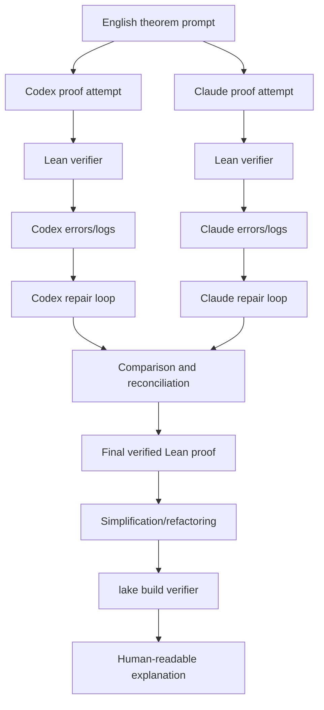

# Proof Pipeline Diagram



## Presentation Point

The key research idea is that Lean acts as the verifier for both generation and simplification. Without the verifier, simplification can silently remove necessary assumptions or change theorem meaning.

## Comparison Layer

The comparison is not only a Markdown table. It is backed by:

```text
multi_model_workflow/run_comparison.py
```

which produces:

```text
multi_model_workflow/comparison_report.md
```

The script checks each generated proof with Lean, records failures, and extracts simple proof-style features for comparison.
