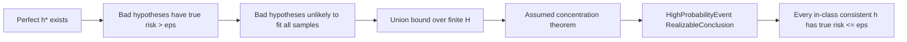
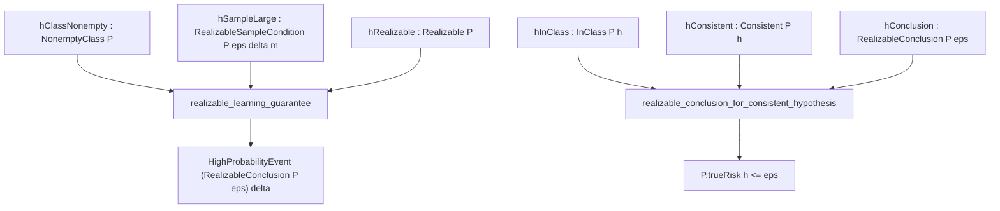
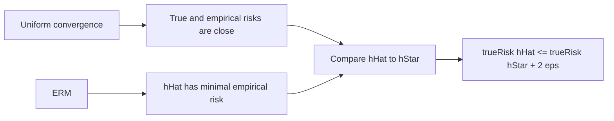
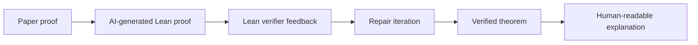
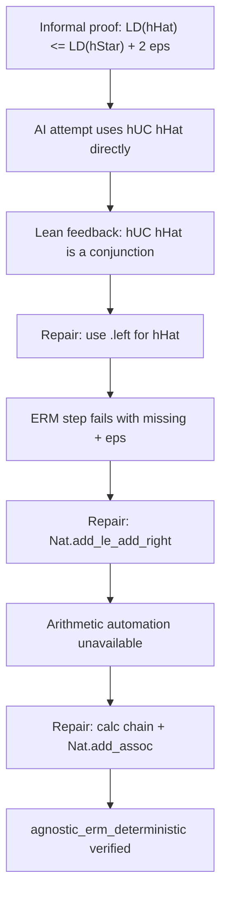

# Visual Theorem Flow

## Realizable Learning

## Realizable Lean Flow

## Agnostic Learning

## MA-LoT-Inspired Workflow

## Agnostic Repair Case Study

## Verification vs Understanding

Lean answers: "Does this proof check?"

The presentation answers: "Why does this proof make sense?"
